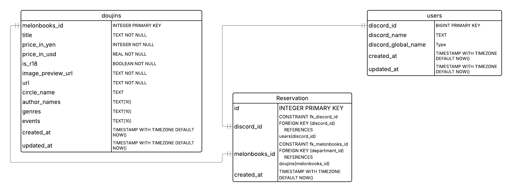

# Comiket Display Backend

This repository contains the backend code for the Comiket Tracker Display, written in Go.
For now, the backend is hot-reloaded using [Air](https://github.com/air-verse/air).
This is only for development purposes.
Later on, this will be disabled.

## Set-up

1. Create a currency conversion API key here: [https://currency.getgeoapi.com/](https://currency.getgeoapi.com/)
1. Create `.env` with the following contents in the root of the project

```
POSTGRES_USER=<postgres_username>
POSTGRES_PASSWORD=<postgres_password>
POSTGRES_DB="comiket"
PGDATA="/var/lib/postgresql/17/docker"
CURRENCY_API+KEY=<currency_api_key>
```

```{bash}
docker-compose -f ./deployments/docker-compose.yml up --detatch
```

## Tear-down

```{bash}
docker-compose -f ./deployments/docker-compose.yml down
```

# Design


